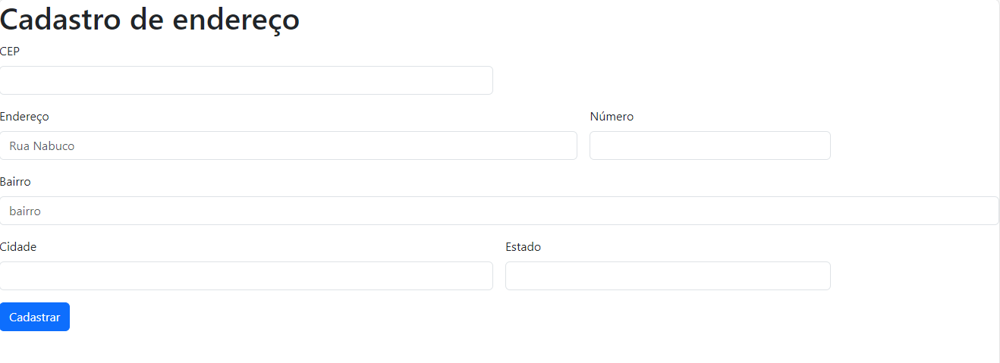
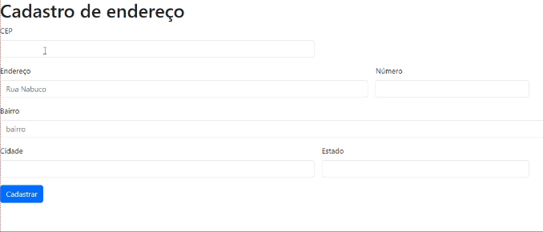
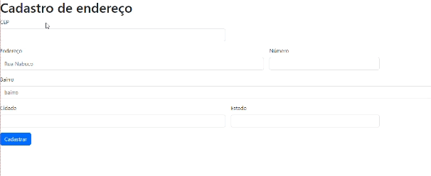
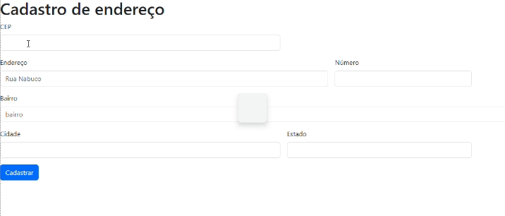

# Cadastro de endereço

<h3>Repositório criado para a disciplina de Linguagem de Programação I para realização da atividade de criação de Cadastro de endereço.</h3>

# Índice
[Introdução](#introduc%C3%A7%C3%A3o)

[Funcionalidades](#funcionalidades)

[Descrição](#descri%C3%A7%C3%A3o) 

[Tecnologias Utilizadas](#tecnologias-utilizadas)  
  
[Autor](https://github.com/miguelitto16/Calendario#autor) 

[colaboradores]()

## Introdução😎
<h3>Este é um exemplo simples de um formulário HTML para cadastro de endereços. O formulário foi criado para coletar informações básicas de endereço, como CEP, rua, número, bairro, cidade e estado.</h3>

## Funcionalidades

`FUNCIONALIDADE 1:`
<h3>Campo Cep sendo completo corretamente</h3>

`FUNCIONALIDADE 2:`
<h3>Campo Cep incompleto</h3>

`FUNCIONALIDADE 3:`
<h3>Todos campos incompletos</h3>

## Descrição
`async:` A palavra-chave async é usada na definição da função pesquisarCep. Ela indica que essa função é assíncrona, o que permite que ela execute operações assíncronas, como a busca na API, sem bloquear a execução do restante do código.

`await:` A palavra-chave await é usada dentro da função pesquisarCep para indicar que o código deve aguardar a conclusão da chamada fetch (que é uma operação assíncrona de busca na API) e a conversão dos dados para JSON antes de prosseguir com a execução. Isso evita que o código continue executando antes que os dados estejam prontos para uso.

`hasOwnProperty:` É um método disponível em objetos JavaScript. Ele é usado para verificar se um objeto possui uma determinada propriedade. No código, é usado para verificar se a resposta da API contém a propriedade 'erro'. Se essa propriedade existir na resposta, isso significa que o CEP não foi encontrado, e um alerta é exibido.

`fetch:` A função fetch é usada para fazer uma solicitação HTTP para uma URL especificada.
No código, a URL é construída com base no valor do CEP fornecido pelo usuário.
A chamada fetch(url) retorna uma promessa que representa a resposta da solicitação HTTP.

`json:`Método json() é usado em uma resposta de uma solicitação HTTP para processar o corpo da resposta como JSON.No código, a linha const addres = await dados.json(); faz a conversão do conteúdo da resposta da API (que é em JSON) em um objeto JavaScript.
O resultado da chamada json() também é uma promessa que resolve para o objeto JavaScript que representa os dados JSON.

### Tecnologias utilizadas👌

* HTML5
* Javascript3
* Via Cep
* Github
* Visual Studio Code
*

## Autor

* [Miguel](https://github.com/miguelitto16)

## colaboradores
* [Gabriel](https://github.com/Braboalenda04)
* [Nicolas](https://github.com/NicolasMussi89)